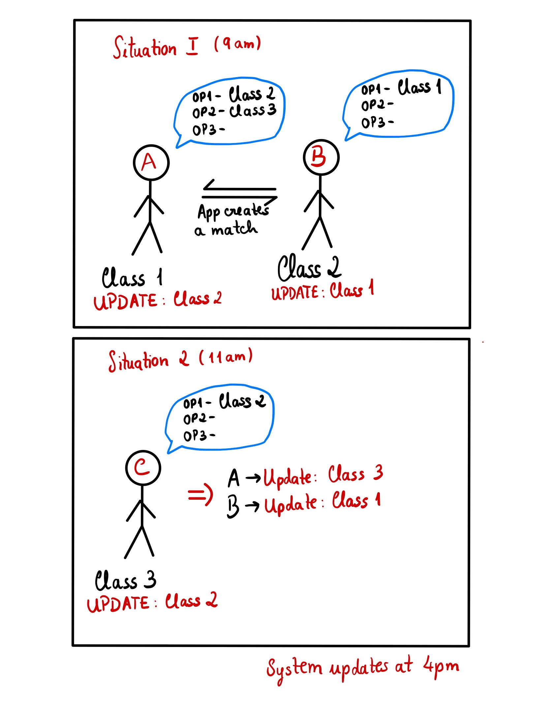

# Swapping

## Short Description

This project's main goal is to build a web platfrom that allows students to request a class swap.
These requests can involve other students or not. When a students specifies all the others ones involved in the exchange, everyone needs to accept the request. When it doesn't involve other students, the application must combine the request with other compatible ones.

 

[PT]

O objetivo deste projeto é criar uma plataforma web que permita estudantes criar pedidos para trocarem de turmas. O pedido pode ser direcionado a outro aluno ou não. Quando este especifica os estudantes envolvidos na troca, fica pendente a aprovação por ambas as partes. Quando um estudante faz um pedido individual (não envolve mais ninguém), a aplicação fica responsável por combinar este pedido com outro ou outros compatíveis.

## Technologies

- Django (Python)
- PostgreSQL

## Application Usage

 

 
