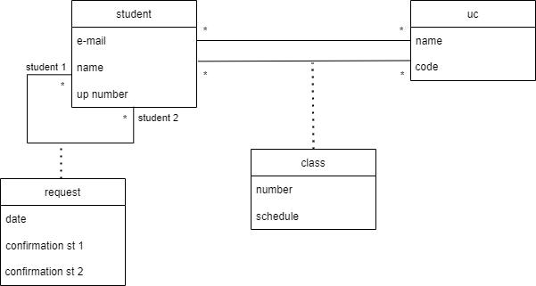

# Documentation from Week 2

## Admin

One of Django's most popular features are administrators.
To create one admin (SuperUser) it was used:

`python manage.py createsuperuser`

Username: admin

E-mail address: lmpa.pt@gmail.com

Password: luisaaraujo

Adding the admin interface to objects:

app/admin.py

`from .models import Question`
`admin.site.register(Question)`

Data can be inserted through Django free API.
`python manage.py shell`, ex:

`st = Student(name ="Eu", up = "2", email = "@)` 
`st.save()`
`Student.objects.all()`

or directly throught the admin panel.

## UML

## State Diagram for Requests

## Relational

- student(<u>id</u>, e-mail, name, up)
- uc(<u>id</u>, name, code)
- class(<u>id</u>, number, schedule)
- studentUC(<u>sID->student</u>, <u>ucID->uc</u>)
- classUC(<u>cID->class</u>, <u>ucID->uc</u>)
- studentClass(<u>sID->student</u>, <u>cID->class</u>)
- request(<u>s1ID->student</u>,<u>s2ID->student</u>, date, confirmation_st1, confirmation_st2)

## Django Models

After linking a database we need to migrate it.
This can be done using the following command:

`python manage.py migrate`

Using models we can create tables for our database.
After creating a model we need to use the command :

`python manage.py makemigrations`

In the folder app/migrations you can notice a new file was added (for example: "0001_initial.py").
Everytime we make migrations no file will be automatically deleted, even if we just changed one attribute of a table a new file will be created with all changes.
"By running makemigrations, you’re telling Django that you’ve made some changes to your models (in this case, you’ve made new ones) and that you’d like the changes to be stored as a migration."

- Run python manage.py makemigrations to create migrations for those changes
- Run python manage.py migrate to apply those changes to the database.

### Fiels

CharField vs TextField

CharField has a length limit (255). So when we need name, emails, etc, inputs CharField is a better choice to ensure more accuracy to the data we are receiving.

## Problems

- CSS files not working properly

Details:
Everytime I update, let's say, the background color, no changes would happen.

<b> FIXED: </b>

The problem was in chrome. When I tried localhost on microsoft edge everything work properly.
https://stackoverflow.com/questions/47415844/django-css-works-on-chrome-but-not-firefox

