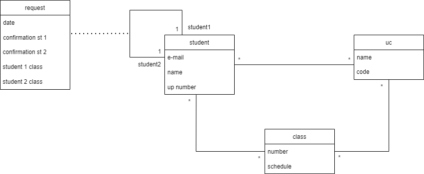

# Documentation from Week 2

## Admin

One of Django's most popular features are administrators.
To create one admin (SuperUser) it was used:

`python manage.py createsuperuser`

Username: admin
E-mail address: lmpa.pt@gmail.com
Password: luisaaraujo

## UML

